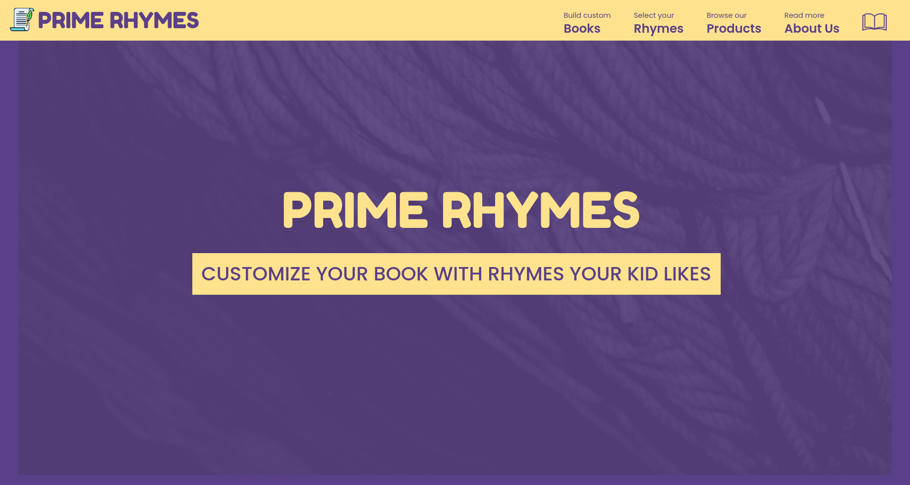

# Prime-Rhymes

## Table of Content
- [Deployment Link](https://github.com/Sanket-Mathur/Prime-Rhymes#deployment-link)
- [General Information](https://github.com/Sanket-Mathur/Prime-Rhymes#general-information)
- [Technologies](https://github.com/Sanket-Mathur/Prime-Rhymes#technologies)
- [Run Locally](https://github.com/Sanket-Mathur/Prime-Rhymes#run-locally)

## Deployment Link
### [Prime Rhymes](https://primerhymes.ga)
 

## General Information
A website for browsing rhymes for kids and customizing books with rhymes that your little one likes.
#### Idea
In supermarkets we get a limited amount of options when selecting rhyme books for children. Rhyme books come packed with specific poems and rhymes which makes you go through several books before selecting one that might not even satisfy all your expectations but you will have to compromise on some.  
We have a solution for your problem. On our application, you can select exactly all the rhymes you want in your book and not just that, you can even customize your book to match your needs.
#### Implementaion
We respect different tastes of children when it comes to rhymes and that's why we give you the option to customize your rhyme book. Generate a rhyme book, add rhymes of your choice, order the book which will be delivered to your doorstep.

## Technologies
- HTML
- CSS
    - Bootstrap v5.0.0-beta3
- JavaScript
    - Vue.js Vue3
- Git

## Run Locally
- In order to run the project locally, clone the repository into your system or download the code in zip format.
- Open a terminal or command line window in the prime-rhymes folder 
- Follow the steps to install modules and start your server given in [prime-rhymes/README.md](https://github.com/Sanket-Mathur/Prime-Rhymes/tree/main/prime-rhymes#prime-rhymes)
- Once the server is online, open the localhost address in your browser